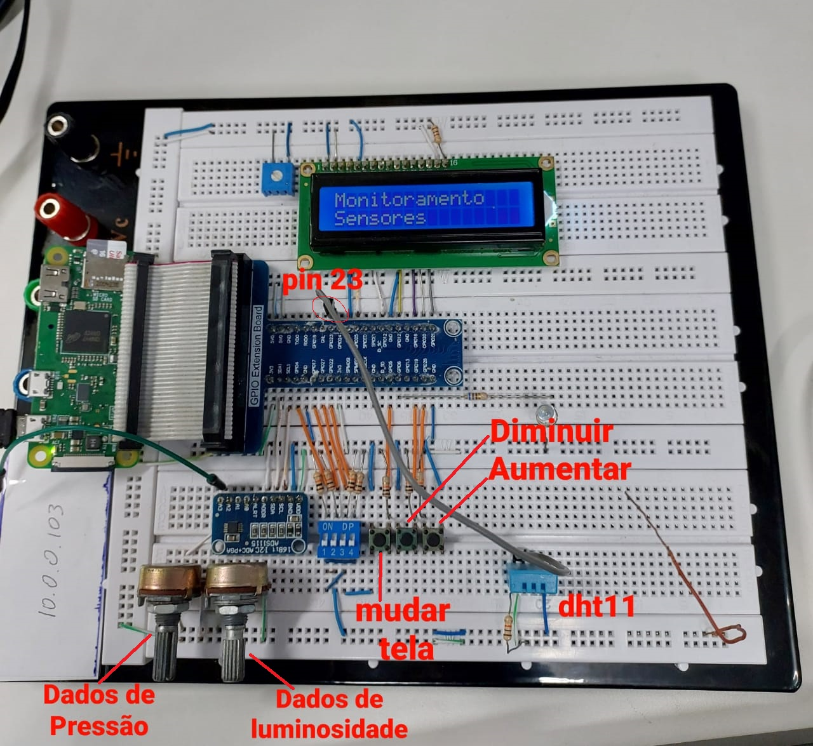
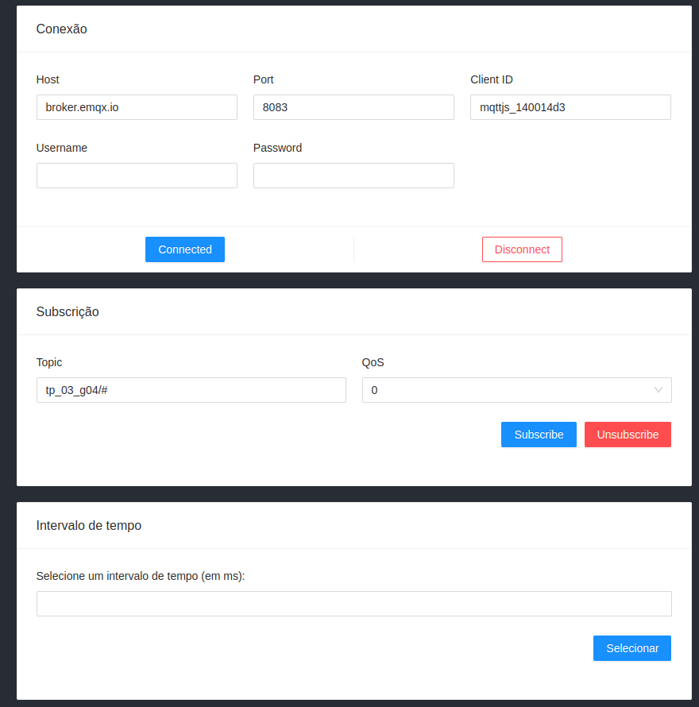
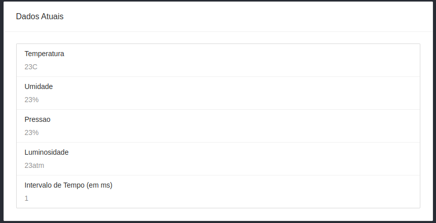
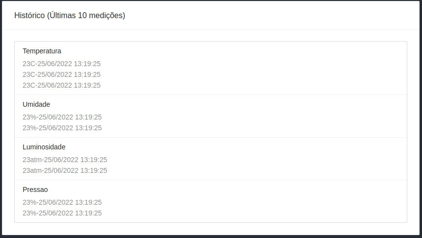

# Sistemas Digitais Problema 3

Foi solicitado um sistema para ser implementado na raspberry pi zero, onde medirá temperatura, umidade, pressão atmosférica e luminosidade através de sensores. Esses dados e a visualização do histórico com as 10 últimas medições de cada sensor terão que ser apresentados no display lcd presente na placa e também na interface remota. Além disto, o sistema deve permitir o ajuste local e remoto do intervalo de tempo que serão realizadas as medições. Para comunicação entre as interfaces foi utilizado o protocolo MQTT.

## Equipe

Bianca Santana de A. Silva

Nilson Augusto Magalhães Moraes Neto

## Diagrama do projeto


Como podemos observar àcima, o sistema é composto por três principais entidades:
-  A interface local, implementada em C e que estará rodando na raspberry pi. Nela possuimos três threads (contando com a principal) para que possamos atender aos principais requisitos do sistema: 
    - Controlar a interface local do display de LCD com botões, incluindo também alteração do intervalo de medição e enviar ao broker o valor atualizado. (thread principal);
    - Ler dados dos sensores, persistir um histórico da leitura desses dados e enviar ao broker esses dados;    
    - "Ouvir" do broker quando o intervalo de tempo foi modificado;
- A interface remota, aplicação web implementada em React. Nela é possível:
    - Configurar conexão com o broker;
    - Visualizar as medições atuais;
    - Histórico contendo as últimas 10 medições; 
    - Editar o intervalo de tempo entre as medições;
- Broker MQTT, responsável pela comunicação entre as interfaces.

## Interface local

Na interface local recebemos os dados do sensor dht11, o qual fornece os dados de temperatura e umidade, e do potenciômetro para simular os dados de luminosidade e pressão atmosférica. Para utilizar o potenciómetro usamos a biblioteca ads1115_rpi, nela sendo utilizado o protocolo I2C para comunicação. Através deste protocolo podemos configurar o dispositivo e fazer a leitura de seus dados de conversão  Analógica-Digital. 

No display LCD é possível ver o tempo de medição e alterá-lo utilizando os botões e também são mostrados os dados dos sensores em tempo real e os históricos de cada um, contendo as 10 últimas medições. A persistência de dados dos históricos é feita por meio de arquivos de texto salvos na pasta históricos.

Os arquivos pertecentes a essa interface (ou seja, esses arquivos tem que está dentro da raspberry pi) são os que terminam com .h (as bibliotecas), .c (os executaveis) e a pasta histórico (encontramos os arquivos de texto .txt que guardam os históricos de cada sensor).

Como instalar a biblioteca mosquitto.h para utilização do mosquitto-cliente:
```sh
sudo apt install gcc mosquitto mosquitto-clients libmosquitto-dev
```
Compilando arquivos:
```sh
gcc ads1115_rpi.c main.c cJSON.c -o main -lwiringPi -lwiringPiDev -lpthread -lmosquitto 
```
Executando:
```sh
./main
```

## Interface Remota

A interface foi desenvolvida em React v16.13.1 e é necessária a instalação do [Node.js](https://nodejs.org/) para sua execução.
Pode ser executada a partir de qualquer sistema operacional, visto que é uma aplicação web e rodará no navegador.

A aplicação está dentro do diretório "mqtt-client-React", no qual cada arquivo dentro da pasta "src" foi nomeado fazendo referência ao components implementados na tela.

Após a instalação do Node.Js e a clonagem do repositório:

```sh
cd mqtt-client-React
npm install
npm start
```

A partir daí a aplicação será iniciada e poderá ser acessada pelo navegador através do endereço: http://localhost:3000.

## Comunicação

O formato do envio dos dados através do Broker MQTT são:
- Para o tópico de dados:
    Formato de JSON onde cada dado possui uma lista de no máximo 10 registros referentes ao histórico das últimas medidas.
    ```JSON
    {
        "temperaturas": [], 
        "umidades": [],
        "pressoes": [],
        "luminosidades": [],
    }
    ```
- Para o tópico de intervalo de tempo:
    O valor do intervalo entre as medições em milisegundos (ms).
    ```
        3000
    ```

## Utilizando o sistema
Antes de tudo, como é um sistema baseado na comunicação utilizando o protocolo MQTT, para que o sistema seja executado da maneira correta, é imprescindível que um broker mqtt esteja ativo e sua conexão previamente configurada, principalmente na interface local. 
A configuração na interface local é feita via código, ou seja, é necessário que seja feita uma recompilação do programa para atualizar as configurações. Já a interface remota possui uma interface de configuração da conexão MQTT.

- Local:
    //INSERIR FOTOS E DESCRIÇÕES DE COMO UTILIZAR O SISTEMA.
- Remota:
    passo 1: conectar ao broker;
    passo 2: subscrever ao tópico;
    passo 3: verificar medições e/ou modificar intervalo de medição;    

    

    - Acima podemos observar a interface remota em funcionamento. Primeiro a parte de configuração de conexão do broker. Nela é possível descrever os dados de acesso para ser feita a conexão. Na segunda parte, selecionamos o tópico no qual iremos ficar "ouvindo". A terceira parte é onde o usuário pode selecionar o intervalo de tempo que deseja que sejam feita as medições. Vale lembrar que automaticamente o tópico de publish já está atribuído (tp_03_g04/dados).
    

    - Aqui é mostrada a medição atual dos sensores.
    

    - Históricos com as últimas 10 medições de cada sensor.

    
